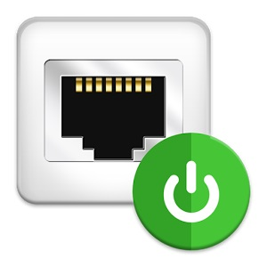
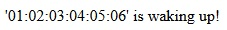
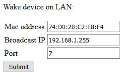

# Wake On Lan PHP library
     

## What is it

This PHP library is designed to easily wake any device or computer on LAN.
It is multi-platform and compatible with PHP5+ (no OS specific call).

## How to install

1) Download <a target="_blank" href="https://github.com/QuentinCG/Wake-On-Lan/blob/master/utils/wakeOnLan.php">the Wake On Lan library</a>

2) Add this file in your PHP server

3) Use it like done with examples in this project

## Examples

Two examples are provided with this library:

### Wake one device on LAN
<a target="_blank" href="https://github.com/QuentinCG/Wake-On-Lan/blob/master/examples/BasicWakeDeviceOnLan/index.php">Link to source code

</a>

### Wake a device on LAN with a form (broadcast IP, MAC address and port)
<a target="_blank" href="https://github.com/QuentinCG/Wake-On-Lan/blob/master/examples/WakeDeviceOnLanGui/index.php">Link to source code

</a>

## License

This project is under MIT license. This means you can use it as you want (just don't delete the library header).

## Contribute

If you want to add more examples or improve the library, just create a pull request with proper commit message and right wrapping.
